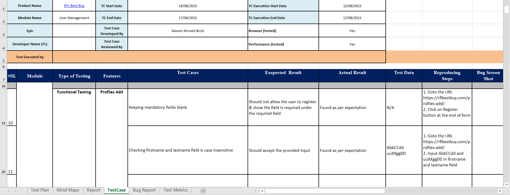
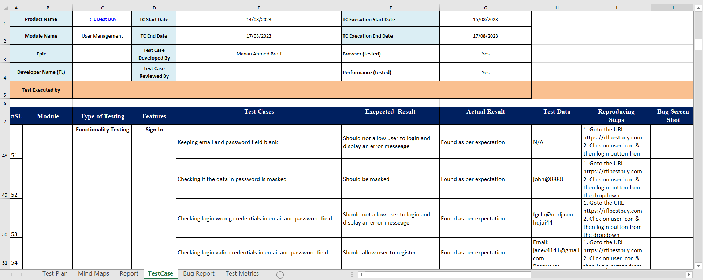
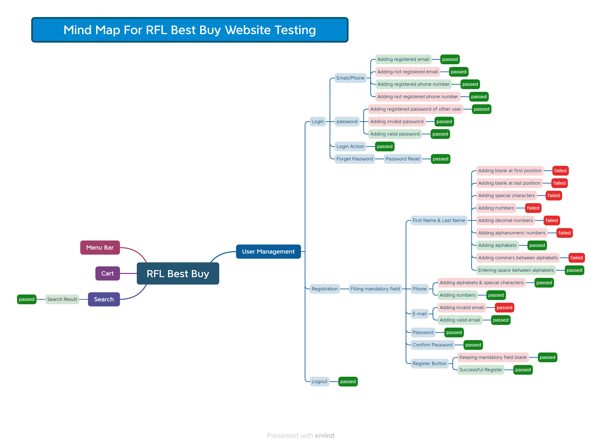

# RFL Best Buy User Management Module Test Report

Welcome to the Test Report for the RFL Best Buy User Management Module. This document provides a comprehensive overview of the testing process, test metrics, SQA Mind Map, Test Cases, and Bug Reports related to the User Management Module.

## Table of Contents
- [Introduction](#introduction)
- [Features Tested](#features-tested)
- [Test Metrics](#test-metrics)
- [Test Cases](#test-cases)
- [SQA Mind Map](#sqa-mind-map)
- [Bug Report](#bug-report)

## Introduction
The RFL Best Buy User Management Module is a critical component of our application responsible for managing user accounts and authentication. This test report aims to ensure the reliability, functionality, and security of this module. URL: https://rflbestbuy.com/

## Features Tested
We have thoroughly tested the following features of the User Management Module:

1. **Profies Add**
   - Ensure new users can register with valid information.
   - Verify email confirmation process.

2. **User Sign In**
   - Confirm users can log in with valid credentials.
   - Validate password recovery functionality.

3. **User Sign In -> Forget Password**
   - Test the assignment and revocation of Forget Password option.

## Test Metrics
During the testing process, we collected the following metrics to evaluate the quality of the User Management Module:

- **Percentage of Test Case Executed:** 100%
- **Test Cases Executed:** 48 out of 48
- **Pass Percentage:** 85.42%
- **Fail Percentage:** 14.58%
- **Percentage of Test Case Blocked:** 0%
- **Bug Severity Distribution:** (See Bug Report Section)

## Test Cases
We have designed and executed a set of test cases to validate the functionality of the User Management Module. Here are some representative test cases:

1. **Profiles Add**
   - **Test Objective:** To verify that a new user can successfully register.
   - **Test Cases:**
     

2. **User Sign In**
   - **Test Objective:** To confirm that a registered user can log in.
   - **Test Cases:**
     

For a complete list of test cases, please refer to the [Test Case Documentation](RFL_Best_Buy.xlsx).

## SQA Mind Map

The SQA mind map illustrates the various aspects of Software Quality Assurance for **User Management** module that were considered during testing. It helps to ensure a comprehensive approach to quality assurance.

## Bug Report
We discovered and documented several bugs during our testing phase. Here is a summary:

| Bug ID | Description | Screenshot |
| ------ | ----------- | -------- |
| BUG-001 | Firstname and lastname field takes blank at first position | Bug_1 |
| BUG-002 | Firstname and lastname field takes blank at lastt position | Bug_2 | 
| BUG-003 | Firstname and lastname field takes special characters input | Bug_3 | 
| BUG-004 | Firstname and lastname field takes numbers input | Bug_4 |
| BUG-005 | Firstname and lastname field takes decimal numbers input | Bug_5 |
| BUG-006 | Firstname and lastname field takes alphanumeric characters input | Bug_6 |
| BUG-007 | Firstname and lastname field takes comma (,) in input field | Bug_7 |

For more details about each bug, please refer to the [complete Bug Report](RFL_Best_Buy.xlsx).

---

This Test Report provides an overview of our testing process, test cases, and the status of the User Management Module. Feel free to reach out for any questions or clarifications.

[Back to Top](#rfl-best-buy-user-management-module-test-report)
