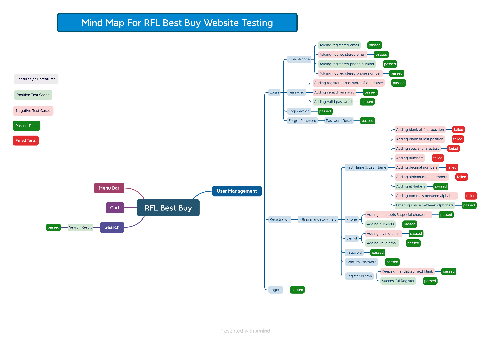

# RFL Best Buy User Management Module Test Report

Welcome to the Test Report for the RFL Best Buy User Management Module. This document provides a comprehensive overview of the testing process, test metrics, SQA Mind Map, Test Cases, and Bug Reports related to the User Management Module.

## Table of Contents
- [Introduction](#introduction)
- [Features Tested](#features-tested)
- [Test Metrics](#test-metrics)
- [Test Cases](#test-cases)
- [SQA Mind Map](#sqa-mind-map)
- [Bug Report](#bug-report)

## Introduction
The RFL Best Buy User Management Module is a critical component of our application responsible for managing user accounts and authentication. This test report aims to ensure the reliability, functionality, and security of this module. URL: https://rflbestbuy.com/

## Features Tested
We have thoroughly tested the following features of the User Management Module:

1. **User Registration**
   - Ensure new users can register with valid information.
   - Verify email confirmation process.

2. **User Sign In**
   - Confirm users can log in with valid credentials.
   - Validate password recovery functionality.

3. **User Sign In -> Forget Password**
   - Test the assignment and revocation of Forget Password option.

## Test Metrics
During the testing process, we collected the following metrics to evaluate the quality of the User Management Module:

- **Percentage of Test Case Executed:** 100%
- **Test Cases Executed:** 48 out of 48
- **Pass Percentage:** 85.42%
- **Fail Percentage:** 14.58%
- **Percentage of Test Case Blocked:** 0%
- **Bug Severity Distribution:** (See Bug Report Section)

## Test Cases
We have designed and executed a set of test cases to validate the functionality of the User Management Module. Here are some representative test cases:

1. **User Registration**
   - **Test Objective:** To verify that a new user can successfully register.
   - **Preconditions:** N/A
   - **Steps:**
     1. Navigate to the registration page.
     2. Enter valid user details.
     3. Submit the registration form.
   - **Expected Result:** User should be registered successfully, and a confirmation email should be sent.

2. **User Sign In**
   - **Test Objective:** To confirm that a registered user can log in.
   - **Preconditions:** User is registered.
   - **Steps:**
     1. Navigate to the login page.
     2. Enter valid credentials.
     3. Click the login button.
   - **Expected Result:** User should be logged in and redirected to the dashboard.

3. **Forget Password**
   - **Test Objective:** To validate the password recovery functionality.
   - **Preconditions:** User has forgotten their password.
   - **Steps:**
     1. Click on the "Forgot Password" link.
     2. Enter a registered email address.
     3. Follow the instructions in the password reset email.
   - **Expected Result:** User should be able to reset their password.

For a complete list of test cases, please refer to the [Test Case Documentation](RFL_Best_Buy.xlsx).

## SQA Mind Map

The SQA mind map illustrates the various aspects of Software Quality Assurance for **User Management** module that were considered during testing. It helps to ensure a comprehensive approach to quality assurance.

## Bug Report
We discovered and documented several bugs during our testing phase. Here is a summary:

| Bug ID | Description | Severity | Status |
| ------ | ----------- | -------- | ------ |
| BUG-001 | Registration page does not load on Firefox | High | Open |
| BUG-002 | Incorrect email format validation error | Medium | Closed |
| BUG-003 | User roles not updating properly | High | In Progress |
| BUG-004 | Profile picture upload fails on slow connections | Low | Closed |

For more details about each bug, please refer to the [complete Bug Report](bug_report.md).

---

This Test Report provides an overview of our testing process, test cases, and the status of the User Management Module. For detailed test case steps and results, please consult the associated test documentation.

Feel free to reach out for any questions or clarifications.

[Back to Top](#rfl-best-buy-user-management-module-test-report)
